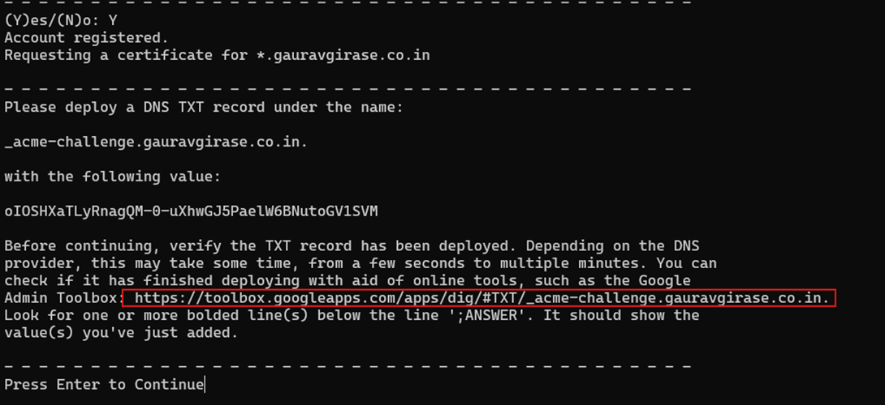
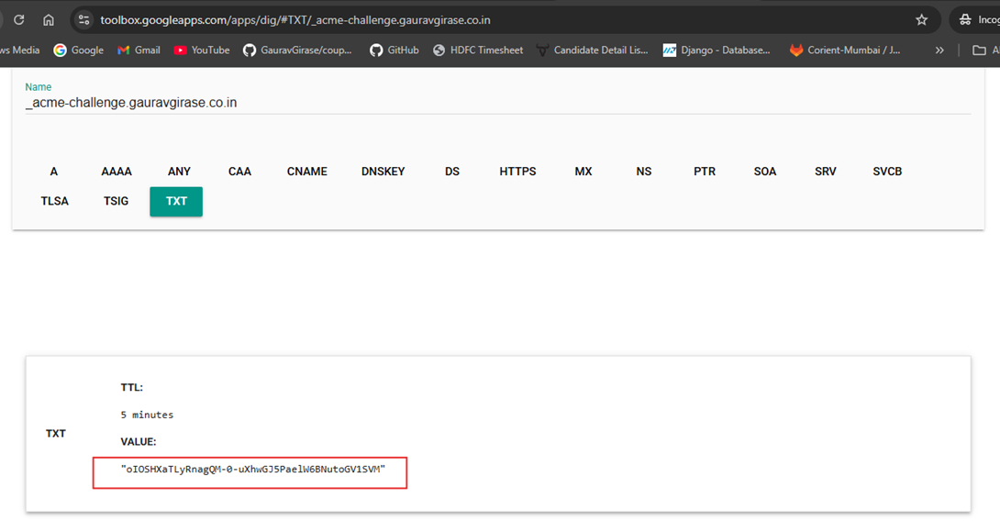
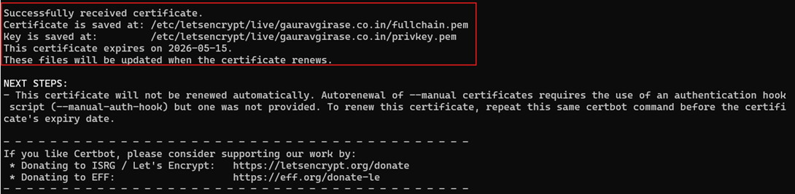
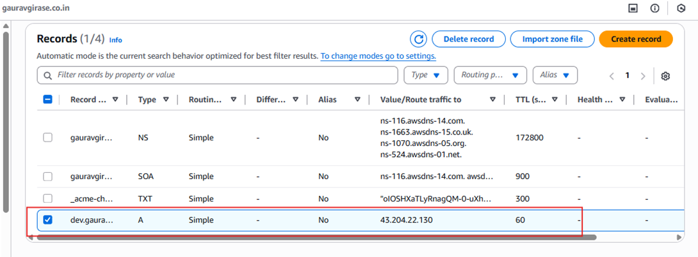
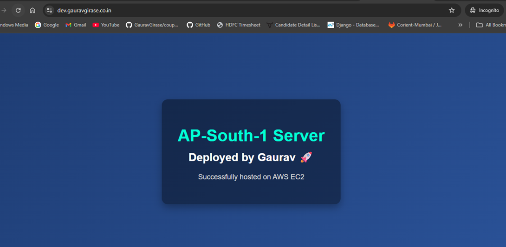

# 🚀 AWS EC2 Website Deployment with Nginx & HTTPS

## 📌 Project Overview
This project demonstrates how to deploy a static website on an AWS EC2 instance using Nginx and secure it with HTTPS using Let's Encrypt SSL certificates.

The goal of this project is to practice cloud infrastructure setup, server configuration, DNS management, and SSL implementation.

---

## 🛠️ Tech Stack

- AWS EC2 (Ubuntu 22.04)
- Nginx Web Server
- Let's Encrypt (Certbot) for SSL
- GoDaddy (Domain Provider)
- Route 53 (Optional DNS management)
- Linux (CLI based configuration)

---

## 🏗️ Architecture

User → Internet → Domain DNS → EC2 Public IP → Nginx → Static Website

---

## ⚙️ Deployment Steps

### 1. Launch EC2 Instance
- Selected Ubuntu 22.04
- Instance type: t2.micro
- Opened ports:
  - 22 (SSH)
  - 80 (HTTP)
  - 443 (HTTPS)

---

### 2. Connect to EC2
```bash
ssh -i your-key.pem ubuntu@your-ec2-public-ip
```
### 2. Install Nginx and Certbot
```bash
sudo apt update
sudo apt install nginx certbot python3-certbot-nginx -y
```
### 3. Issue certficate chain and private key
```bash
sudo certbot certonly –manual  --preferred-challenges=dns -d “*.<DOMAIN_NAME>”
```

### 4. Create a record in route53

### 5. Go to this link


### 6. Certchain and private key generated
```bash
ls /etc/letsencrypt/live/gauravgirase.co.in
fullchain.pem
privkey.pem
```



### 6. Update Nginx configuration
```bash
cat <<EOF >/etc/nginx/sites-available/gauravgirase.co.in
server {
    listen 80;
    server_name gauravgirase.co.in *.gauravgirase.co.in;
    return 301 https://\$host\$request_uri;
}

server {
    listen 443 ssl;
    server_name gauravgirase.co.in *.gauravgirase.co.in;
    ssl_certificate /etc/letsencrypt/live/gauravgirase.co.in/fullchain.pem;
    ssl_certificate_key /etc/letsencrypt/live/gauravgirase.co.in/privkey.pem;
    location / {
        root /var/www/html;
        index index.html index.htm;
    }
}
EOF
```
### 7. Remove default site and create symlink to custome site
```bash
sudo rm -f /etc/nginx/sites-enabled/default
sudo ln -s /etc/nginx/sites-available/gauravgirase.co.in /etc/nginx/sites-enabled/
```

### 8. Deploy code
```bash
sudo cat <<EOF >/var/www/html/index.html
<!DOCTYPE html>
<html lang="en">
<head>
  <meta charset="UTF-8">
  <meta name="viewport" content="width=device-width, initial-scale=1.0">
  <title>AWS Route 53 Region Test</title>
  <style>
    body {
      margin: 0;
      height: 100vh;
      display: flex;
      justify-content: center;
      align-items: center;
      background: linear-gradient(135deg, #1e3c72, #2a5298);
      font-family: Arial, sans-serif;
      color: white;
      text-align: center;
    }
    .container {
      background: rgba(0, 0, 0, 0.4);
      padding: 40px;
      border-radius: 15px;
      box-shadow: 0 8px 20px rgba(0,0,0,0.3);
    }
    h1 {
      font-size: 42px;
      margin-bottom: 10px;
      color: #00ffd5;
    }
    h2 {
      font-size: 28px;
      margin-top: 0;
      color: #ffffff;
    }
    p {
      font-size: 18px;
      margin-top: 15px;
      color: #dcdcdc;
    }
  </style>
</head>
<body>
  <div class="container">
    <h1>AP-South-1 Server</h1>
    <h2>Deployed by Gaurav 🚀</h2>
    <p>Successfully hosted on AWS EC2</p>
  </div>
</body>
</html>
EOF
```
### 9. Start the nginx 
```bash
sudo systemctl enable nginx
sudo systemctl start nginx
```

### 10.Create A record in route 53

### 11.Testing


# Note: Screenshots were taken during the setup process. Hosted zone and DNS records have been removed for security purposes.
